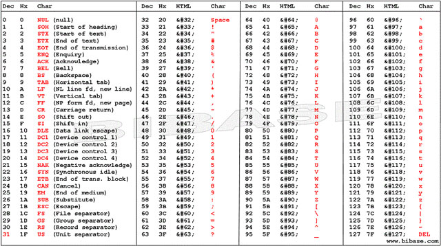

# 📚 Lab Lập Trình Hợp Ngữ ARM Assembly

Chào mừng bạn đến với các bài lab của môn **Lập Trình Hợp Ngữ ARM Assembly**! Dưới đây là danh sách các bài lab với mô tả tổng quan. Hãy chuẩn bị để khám phá và làm việc với các bài tập thú vị!

---

## 🔬 Các Bài Lab

### 1. **Lab 1: Làm Quen Với ARM Assembly**

- **Mục Tiêu:** Giới thiệu các khái niệm cơ bản và lệnh cơ bản trong ARM Assembly.
- **Yêu Cầu:** Viết một chương trình đơn giản về tính toán.

### 2. **Lab 2: Thực hành làm việc với chuỗi và ma trận**

- **Mục Tiêu:** Biết cách thao tác với chuỗi( mảng 1 chiều) và ma trận( mảng đa chiểu) bằng các lệnh cơ bản trong ARM Assembly.
- **Yêu Cầu:** Viết một chương trình đơn giản về xử lý dữ liệu trong chuỗi và ma trận.

### 3. **Lab 3: Thực hành làm việc với chương trình con**

- **Mục Tiêu:** Biết cách thao tác với chương trình con và làm việc qua lại giữa chương trình con và chương trình chính.
- **Yêu Cầu:** Viết các bài tập trong lab 1 bằng kiến thực học trong lab 3.

### 4. **Lab 4: Thực hành làm việc với chương trình con (tiếp)**

- **Mục Tiêu:** Nâng cao của lab3.
- **Yêu Cầu:** Viết các bài tập trong lab 2 bằng chương trình con.

### 5. **Lab 5: Thực hành làm việc với chuỗi bit**

- **Mục Tiêu:** Biết cách thao tác với chuỗi bit cơ bản và chuyển đổi cơ số.
- **Yêu Cầu:** Viết các bài tập chuyển đổi cơ số và thao tác với chuỗi bit.

### 6. **Lab 6: Thực hành làm việc với chuỗi**

- **Mục Tiêu:** Biết cách thao tác với chuỗi cơ bản.
- **Yêu Cầu:** Viết các bài tập thao tác với chuỗi.

### 7. **Lab 7: Bài tập nâng cao (mức độ vân dụng thấp)**

### 8. **Lab 8: Bài tập nâng cao (mức độ vân dụng)**

---

## 📖 Tài Nguyên Hữu Ích

- [Youtube của tôi @Horob1 - nơi chia sẻ kinh nghiệm của tôi và giải đáp thắc mắc!](https://www.youtube.com/@Horob1)
- Bảng mã ascii

---

## 📅

_Chuẩn bị bởi [Horob1] -Lập trình hợp ngữ ARM Assembly_
