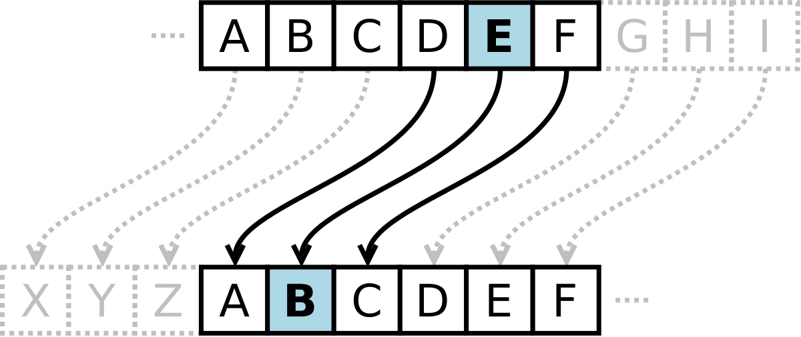

# Giải thích Bài 1 Lab 8: Mã hóa chuỗi ký tự bằng Assembly

Ý tưởng giống mật mã mật mã caesar.



> Trong mật mã học, mật mã Caesar (còn được gọi là mật mã của Caesar, mật mã chuyển vị, mã của Caesar hay chuyển vị Caesar) là một trong những kỹ thuật mã hóa đơn giản và phổ biến nhất. Đây là một dạng mật mã thay thế, trong đó mỗi ký tự trên bản rõ sẽ được thay bằng một ký tự khác, có vị trí cách nó một khoảng xác định trong bảng chữ cái. Ví dụ với độ dịch chuyển là 3, D sẽ trở thành A, E sẽ trở thành B,...

```assembly
; Khai báo vùng nhớ RESET chứa dữ liệu, chỉ đọc
AREA RESET, DATA, READONLY
    DCD 0X20000000      ; Địa chỉ stack pointer
    DCD MAIN            ; Địa chỉ bắt đầu chương trình tại nhãn MAIN
XauRo DCB "Sinh Vien KMA", 0 ; Chuỗi ký tự "Sinh Vien KMA" cần mã hóa, kết thúc bằng ký tự NULL (0)
K DCB 3                 ; K là giá trị dịch chuỗi (shift)

; Khai báo vùng nhớ MYDATA có thể đọc/ghi
AREA MYDATA, DATA, READWRITE
XauMa DCB 0             ; Bộ nhớ để lưu chuỗi đã mã hóa

; Khai báo vùng mã nguồn, chỉ đọc
AREA MYCODE, CODE, READONLY
    ENTRY               ; Điểm vào của chương trình

; Hàm mã hóa ENCODE
ENCODE PROC
    CMP R1, #0x20       ; So sánh ký tự hiện tại với khoảng trắng (ASCII 0x20)
    BEQ STOP_P          ; Nếu là khoảng trắng, dừng xử lý (BEQ: Branch if Equal)
    ADD R1, R1, R2      ; Cộng giá trị dịch R2 vào ký tự hiện tại (R1)

    CMP R1, #0x5A       ; So sánh với ký tự 'Z' (0x5A)
    BLE STOP_P          ; Nếu nhỏ hơn hoặc bằng 'Z', dừng lại vì đã mã hóa thành công (do kí tự sau khi mã hóa vẫn nàm trong bảng chữ cái in hoa)

    CMP R1, #0x61       ; So sánh với ký tự 'a' (0x61)
    BLE HASH_UP         ; Nếu nhỏ hơn hoặc bằng 'a', chuyển sang xử lý ký tự in hoa
    CMP R1, #0x7A       ; So sánh với ký tự 'z' (0x7A)
    BLE STOP_P          ; Nếu nhỏ hơn hoặc bằng 'z', dừng lại vì đã mã hóa thành công (do kí tự sau khi mã hóa vẫn nàm trong bảng chữ cái in thường)

    ; Mã hóa ký tự thường (lowercase)
    SUB R1, R1, #0x7A   ; Dịch ngược giá trị R1
    ADD R1, R1, #0x61   ; Cộng giá trị về lại từ 'a'
    B STOP_P            ; Kết thúc

HASH_UP
    ; Mã hóa ký tự in hoa (uppercase)
    SUB R1, R1, #0x5A   ; Dịch ngược giá trị R1 từ 'Z'
    ADD R1, R1, #0x41   ; Cộng giá trị về lại từ 'A'
    B STOP_P            ; Kết thúc

STOP_P
    BX LR               ; Kết thúc hàm ENCODE
    ENDP

; Chương trình chính MAIN
MAIN
    LDR R0, =XauRo      ; Load địa chỉ của chuỗi gốc (XauRo) vào R0
    LDRB R2, K          ; Load giá trị dịch chuỗi (K) vào R2
    MOV R5, #26         ; Đặt giá trị R5 = 26 (để sử dụng cho phép chia)
    UDIV R4, R2, R5     ; Chia R2 cho 26, lưu thương vào R4
    MUL R4, R4, R5      ; Nhân lại với 26
    SUB R2, R2, R4      ; Lấy phần dư để R2 < 26

    LDR R3, =XauMa      ; Load địa chỉ của chuỗi mã hóa (XauMa) vào R3

LOOP
    LDRB R1, [R0], #1   ; Load ký tự từ chuỗi gốc vào R1 và tăng địa chỉ R0
    CMP R1, #0          ; So sánh với ký tự NULL (kết thúc chuỗi)
    BEQ STOP            ; Nếu gặp ký tự NULL, dừng chương trình

    BL ENCODE           ; Gọi hàm ENCODE để mã hóa ký tự
    STRB R1, [R3], #1   ; Lưu ký tự đã mã hóa vào chuỗi mới (XauMa) và tăng địa chỉ R3
    B LOOP              ; Quay lại LOOP để xử lý ký tự tiếp theo

STOP
    B STOP              ; Dừng chương trình
    END                 ; Kết thúc chương trình
```
